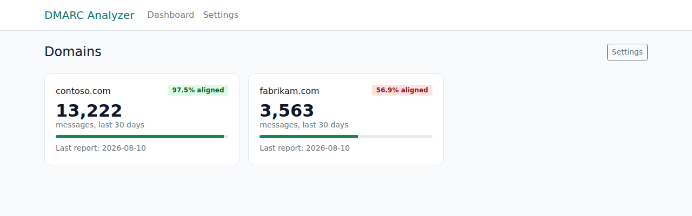
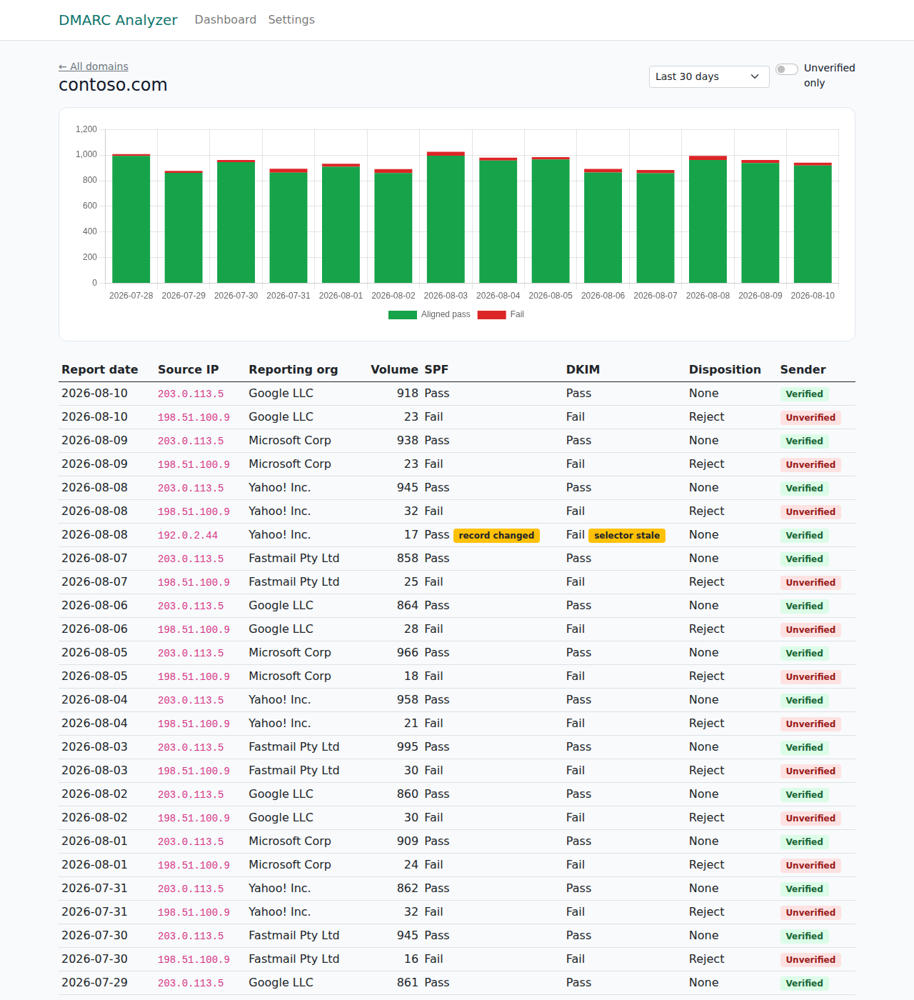
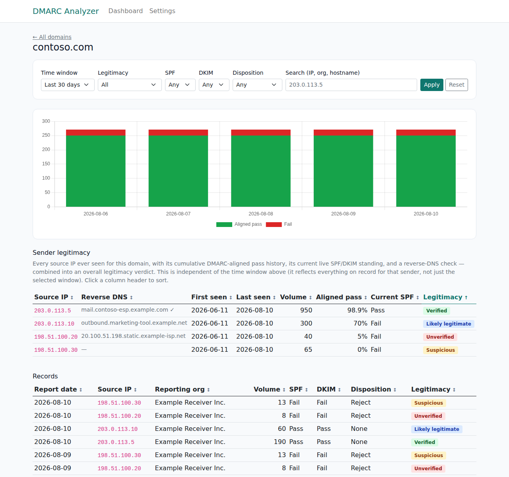
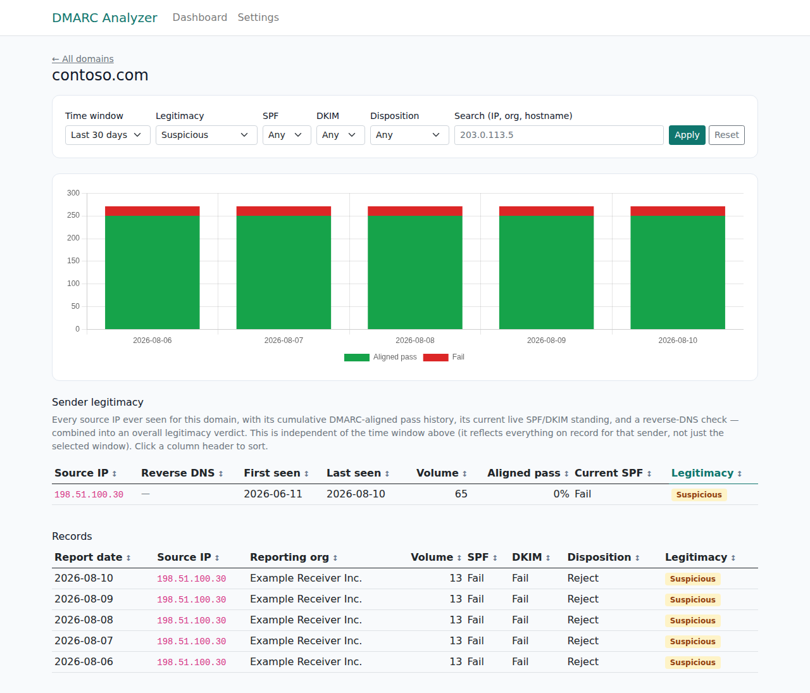
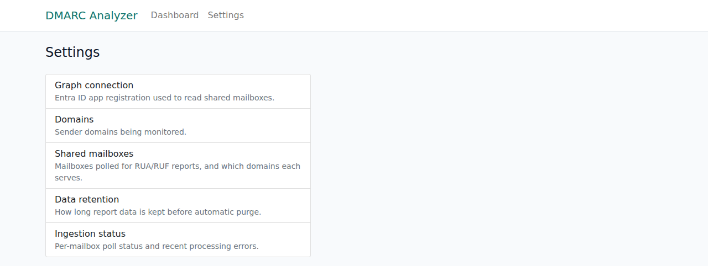
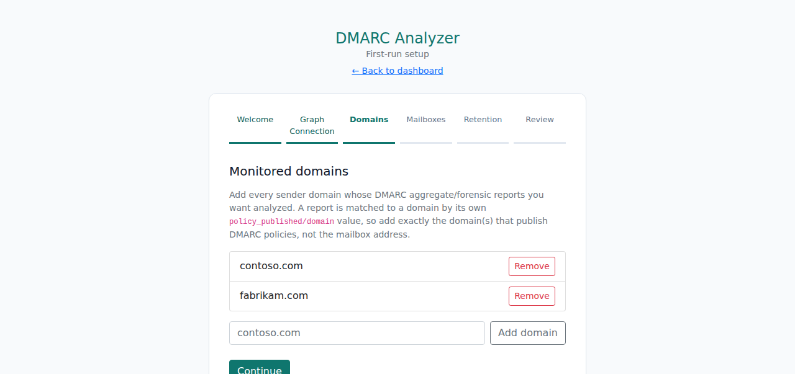
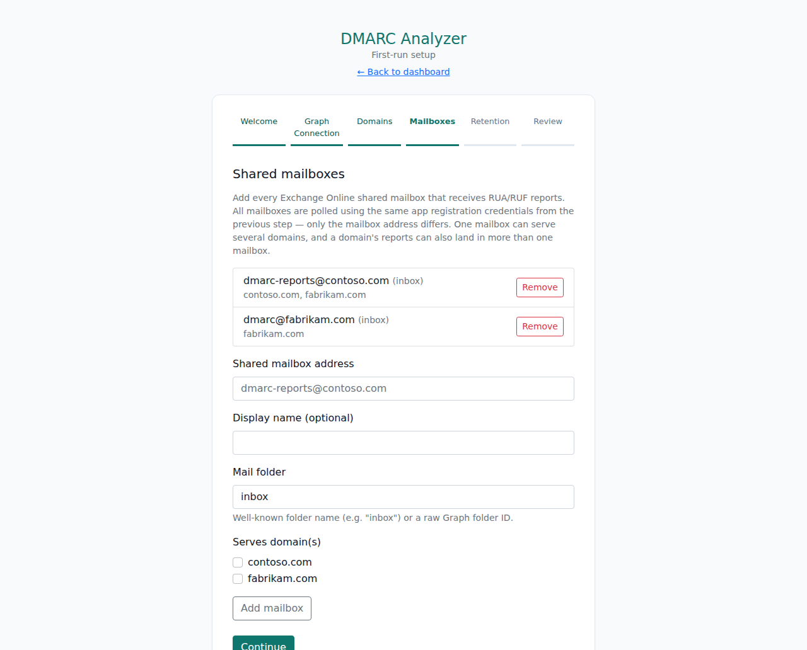
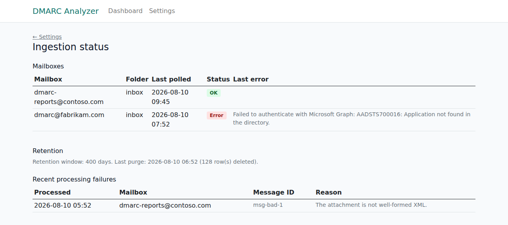
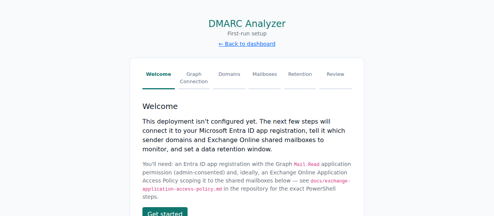
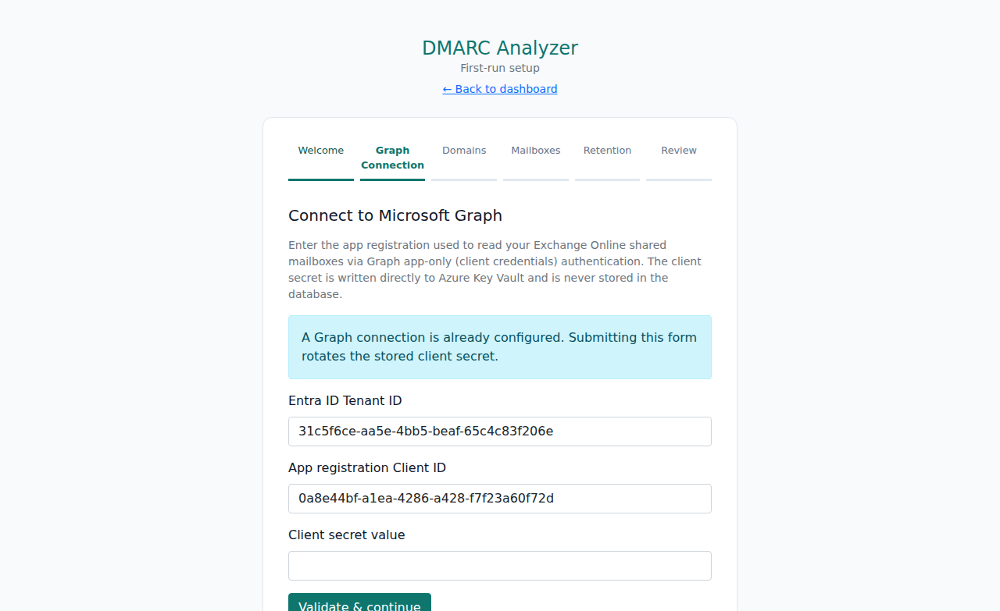

# DMARC Analyzer


[](https://scorecard.dev/viewer/?uri=github.com/TenOfNine/AzureHosted-DMARC-Analyzer)


A self-hosted DMARC report analyzer, deployed as an Azure App Service. It ingests RUA/RUF reports
from Exchange Online shared mailboxes via Microsoft Graph, and goes beyond just showing what a
report claims: it independently re-checks each sending domain's **current** SPF record and DKIM
selectors against every reported source IP, to catch drift between what a report says and what's
actually authorized today.

The same codebase is redeployable per organization — Entra ID app registration, monitored
domains, shared mailboxes, and retention are all configured through an in-app setup wizard, not
baked into the deployment template.

## Architecture

```
src/
  DmarcAnalyzer.Core            Pure domain logic: RFC 7489 XML parsing, RFC 7208 SPF evaluation,
                                 DKIM selector checking, sender-legitimacy scoring.
                                 No Azure/EF/Graph dependency — fully unit-testable offline.
  DmarcAnalyzer.Infrastructure  EF Core (Azure SQL), Microsoft Graph client, Key Vault secret
                                 store, DNS resolution, background ingestion + retention jobs.
  DmarcAnalyzer.Web             ASP.NET Core Razor Pages: setup wizard, dashboard, settings.
tests/DmarcAnalyzer.Tests       xUnit tests against fakes (no network access needed).
tools/GrantSqlAccess            Small deploy-time utility granting the Web App's managed identity
                                 access to Azure SQL (Bicep can't create database users).
infra/                          Bicep: App Service, Azure SQL (AAD-only auth), Key Vault, App
                                 Insights — parameterized generically for reuse per deployment.
.github/workflows/               CI (build/test/format) and CD (OIDC → Bicep → migrate → deploy).
docs/                           Deployment guide and the one manual Exchange Online step.
```

See [`docs/technical-specification.md`](docs/technical-specification.md) for the full functional
and technical specification (requirements, data model, sequence diagrams, security posture,
verification evidence), [`docs/deployment.md`](docs/deployment.md) for how to stand up a new
instance, and [`docs/exchange-application-access-policy.md`](docs/exchange-application-access-policy.md)
for scoping the Graph app registration to only the mailboxes it should read.

## How it works

1. A background job polls each configured shared mailbox via Graph delta query, extracts DMARC
   aggregate report attachments (zip/gzip/raw XML), and parses them (RFC 7489).
2. Each report is matched to a monitored domain by its own `policy_published/domain` — not by
   which mailbox it arrived in, since one mailbox commonly serves several domains and vice versa.
3. For every record (source IP), the domain's **live** SPF record is re-evaluated against that IP
   (full RFC 7208: recursive includes, redirect, CIDR matching, the 10-lookup limit) and compared
   against what the report itself claimed — a mismatch is flagged as a discrepancy. DKIM selectors
   are checked for continued DNS presence, flagging ones that have since been rotated or revoked.
4. Every source IP is also scored for overall **sender legitimacy** — combining its cumulative
   DMARC-aligned pass history, its current live SPF/DKIM standing, an admin allowlist match, and a
   forward-confirmed reverse-DNS check — into a Verified/Likely legitimate/Unverified/Suspicious
   verdict (see [`docs/technical-specification.md`](docs/technical-specification.md#35-sender-legitimacy-scoring)
   for the exact rules).
5. The dashboard shows per-domain pass-rate trends, a dedicated sender-legitimacy table, and a
   per-record breakdown — all filterable by legitimacy level, SPF/DKIM result, disposition, or a
   free-text search, with sortable columns.
6. Report data older than a configurable retention window is purged automatically.

## Screenshots

*Illustrative screenshots from a local run seeded with sample data — not a real tenant.*

### Dashboard — per-domain overview



`/Dashboard` (also the app's root URL). One card per monitored domain: 30-day message volume,
DMARC-aligned pass rate, and the last report received. Click a card to drill in.

### Domain detail — trend chart, sender legitimacy, and per-record verification



`/Dashboard/DomainDetail`. Filter bar (time window, legitimacy level, SPF/DKIM result,
disposition, free-text search), the daily pass/fail volume chart, a **sender legitimacy** table
(one row per source IP ever seen, with its reverse-DNS hostname, cumulative volume/pass rate,
current live SPF standing, and overall legitimacy badge — click a header to sort), and the
per-record table below it carrying the same legitimacy badge plus the two "beyond what the report
claims" flags: **record changed** (today's live SPF re-evaluation for that source IP no longer
agrees with what the report recorded) and **selector stale** (the DKIM selector it signed with has
since been revoked or removed from DNS).



Every column header in both tables is clickable — here the sender table is sorted by legitimacy
level (note the ↑ indicator and the active blue header).



The legitimacy filter applied to `Suspicious` — this is what "find the non-legitimate senders"
looks like in practice: both tables collapse to just the flagged sender/records.

### Settings hub



`/Settings`. Central entry point to every configuration area below.

### Domains and shared mailboxes




`/Setup/Domains` and `/Setup/Mailboxes` (these pages serve double duty as both the first-run setup
wizard *and* the ongoing settings pages — nothing changes once initial setup is done, they stay
directly reachable). This is where the "one App Registration, several shared mailboxes, each
mailbox serving one or more domains" configuration happens — see the mailbox list showing
`dmarc-reports@contoso.com` serving both `contoso.com` and `fabrikam.com`, and each mailbox's
domain checkboxes on the add form.

### Ingestion status



`/Settings/IngestionStatus`. Per-mailbox last-poll timestamp/status/error (here `dmarc@fabrikam.com`
shows a simulated Graph auth failure), the retention job's last run, and recent per-message
processing failures — the operational view for "is ingestion actually working."

### First-run setup wizard




`/Setup/Welcome` onward. Walks through connecting the Entra ID app registration (validated live
against Graph before anything is saved, then the secret is written straight to Key Vault), adding
domains and mailboxes, and setting the retention window. A fresh deployment redirects here
automatically until all of it is complete.

## Security

- **Sign-in required**: Azure App Service Authentication ("Easy Auth") gates every request behind
  Microsoft Entra ID sign-in at the platform level, in front of the setup wizard and dashboard
  alike — enabled by default (`enableEntraIdAuth` in `infra/main.bicep`); see
  [`docs/deployment.md`](docs/deployment.md#3-set-up-sign-in-authentication-easy-auth) for setup.
- **Hardened response headers**: a restrictive Content-Security-Policy (nonce-based `script-src`,
  no external origins — everything under `wwwroot/lib` is vendored, nothing loads from a CDN),
  `X-Frame-Options`, `X-Content-Type-Options`, `Referrer-Policy`, and `Permissions-Policy` on every
  response (`SecurityHeadersMiddleware`).
- **Untrusted-input hardening**: the DMARC report XML parser explicitly blocks DOCTYPE processing
  (XXE / entity-expansion), and zip/gzip attachment extraction is capped at 50 MB of actual
  decompressed bytes — the shared mailbox accepts attachments from arbitrary internet senders, so
  both are real, not theoretical, attack surface.
- **No password-based credentials anywhere**: Graph access is app-only OAuth, SQL access is Azure
  AD-only (managed identity), Key Vault access is managed identity via RBAC, and GitHub Actions
  authenticates to Azure via OIDC federated credentials.
- **Auditable by default**: every Bicep-deployed resource is tagged, and Web App/Key Vault/SQL
  audit logs are routed to the deployment's Log Analytics workspace automatically; a
  [`secret-scan.yml`](.github/workflows/secret-scan.yml) workflow scans every push/PR with
  gitleaks. The architecture was reviewed against the
  [Microsoft Cloud Security Benchmark](https://learn.microsoft.com/en-us/security/benchmark/azure/overview) —
  see NFR-SEC-1–13 and §5.2.1 in
  [`docs/technical-specification.md`](docs/technical-specification.md#5-non-functional-requirements)
  for the full list, including the larger-tradeoff controls (private endpoints, customer-managed
  keys, Defender for Cloud) that are documented but deliberately not applied by default.
- **OpenSSF Scorecard**: [`scorecard.yml`](.github/workflows/scorecard.yml) runs a weekly automated
  supply-chain security assessment of this repository and publishes the badge above. Every one of
  our own workflows already declares least-privilege `permissions:` — see §5.2.2 in
  [`docs/technical-specification.md`](docs/technical-specification.md#522-openssf-scorecard-notes)
  for why a few Scorecard checks (Fuzzing, Packaging, Signed-Releases, CII Best Practices) score low
  here by design rather than by omission.
- **Pinned dependencies**: every GitHub Action across all workflows is pinned by commit SHA (not a
  floating tag), and every NuGet dependency is locked by exact version + content hash via a
  `packages.lock.json` per project, enforced in CI (`dotnet restore --locked-mode`).
  [`dependabot.yml`](.github/dependabot.yml) opens weekly update PRs for both. See
  [`SECURITY.md`](SECURITY.md) to report a vulnerability.

## Testing

```
Passed!  - Failed: 0, Passed: 65, Skipped: 0, Total: 65
```

65 xUnit tests cover the RFC 7489 XML parser (including DOCTYPE/XXE rejection), the RFC 7208 SPF
evaluator (CIDR boundaries, recursive `include`, `redirect`, the 10-lookup limit, all qualifiers),
the DKIM selector checker, the sender-legitimacy scoring rules, attachment extraction (including
the decompression-bomb size guard), and the ingestion pipeline (dedupe, per-message failure
isolation, sender-reputation aggregation) — all against hand-written fakes for Graph/DNS, so the
suite needs no network access and runs the same locally as in CI.

Every pull request and push to `main` runs three workflows, all required to be green before
merging:

| Workflow | What it checks |
| --- | --- |
| [`ci.yml`](.github/workflows/ci.yml) | `dotnet build`, `dotnet format --verify-no-changes` (lint), `dotnet test` with code coverage collection |
| [`codeql.yml`](.github/workflows/codeql.yml) | [CodeQL](https://codeql.github.com/) static analysis for C#, plus a weekly scheduled scan |
| [`dependency-review.yml`](.github/workflows/dependency-review.yml) | Flags newly introduced dependencies with known vulnerabilities or high-severity advisories |

## Development

```bash
dotnet build
dotnet test
```

Running the app locally requires a reachable SQL Server and a real Azure Key Vault your local
identity has access to — see [`docs/deployment.md`](docs/deployment.md#local-development).

## License

Licensed under the [PolyForm Noncommercial License 1.0.0](LICENSE) — free to use, modify, and
self-host for any noncommercial purpose; commercial use (including resale or offering it as a
paid/commercial service) requires a separate agreement with the copyright holder. Vendored
front-end assets under `src/DmarcAnalyzer.Web/wwwroot/lib/` (Bootstrap, jQuery, Chart.js) keep
their own original MIT licenses.
