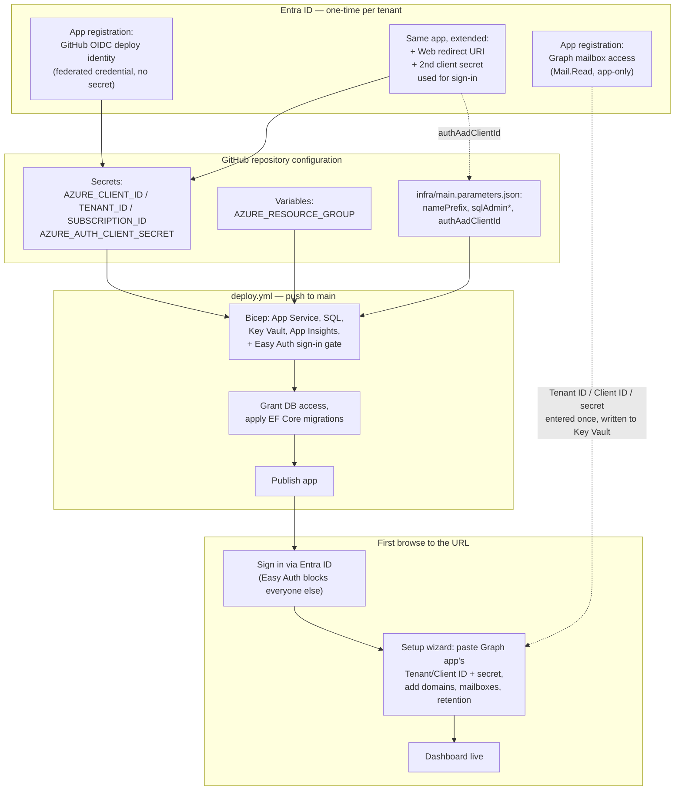

# Deploying a new instance

This deployment template is generic — the same repository can be deployed once per
organization/customer into a fresh Azure resource group, with all tenant-specific configuration
(Entra ID app registration, monitored domains, shared mailboxes, retention) captured afterward
through the in-app setup wizard rather than baked into the infrastructure template.

The whole journey, end to end:



Three app registrations are involved, and it's easy to mix them up — they're deliberately kept
separate so that rotating or revoking one never affects the others:

| # | Purpose | Where it's used |
|---|---|---|
| 1 | **Graph mailbox access** — the app reads shared mailboxes | Its Tenant ID/Client ID/secret are entered once, in-app, via the setup wizard's Graph Connection step (§6 below) |
| 2 | **Sign-in (Easy Auth)** — gates every request behind Entra ID login | Its Client ID goes into `infra/main.parameters.json`; its secret is passed only at deploy time via a GitHub Actions secret |
| 3 | **GitHub Actions OIDC deploy identity** — lets the workflow provision Azure resources | Federated credential; no client secret ever exists for this one |

\#2 can be the **same** App Registration as #1, extended with a Web platform redirect URI and a
second client secret — that's the simpler path and what the steps below assume — or a separate one
if you'd rather keep sign-in and mailbox access fully independent.

## 1. Prerequisites

- An Azure subscription and a resource group to deploy into (region: Germany West Central by
  default — `germanywestcentral`).
- Permission to create Entra ID app registrations and a federated credential.
- Permission to set the initial Azure AD administrator on the Azure SQL logical server (this can
  be your own account, or — recommended for CI/CD — a group that includes the deploy pipeline's
  identity; see step 3).

## 2. Create the Entra ID app registration used by the app itself (Graph access)

This is the app registration DMARC Analyzer uses at runtime to read shared mailboxes via
Microsoft Graph. It is **separate** from the app registration used for GitHub Actions deployment
(step 3).

1. Entra ID portal → App registrations → New registration. Any name/redirect URI (none needed —
   this is a daemon/client-credentials app).
2. API permissions → Add a permission → Microsoft Graph → **Application permissions** →
   `Mail.Read` → Add, then **Grant admin consent**.
3. Certificates & secrets → New client secret. Copy the secret value — you'll enter it once in the
   app's setup wizard (Graph Connection step) after the first deploy; it is written to Key Vault
   at that point and never stored anywhere else.
4. Note the **Tenant ID**, **Client ID**, and the secret value for the setup wizard.
5. Follow [`exchange-application-access-policy.md`](./exchange-application-access-policy.md) to
   scope this app registration to only the shared mailboxes it should be able to read.

## 3. Set up sign-in authentication (Easy Auth)

Without this, the setup wizard and dashboard — including the ability to rotate the Graph client
secret and add/remove monitored mailboxes — are reachable by **anyone who can resolve the URL**,
since the app has no login of its own by design. Azure App Service Authentication ("Easy Auth")
closes that gap at the platform level, in front of the whole app, with no application code
involved. It's controlled by `enableEntraIdAuth` (default `true`) in `infra/main.bicep` — leave it
on unless the app sits behind some other equivalent access control (private network, gateway
auth), and treat turning it off as a deliberate, documented exception, not a default.

1. On the **same** app registration from step 2 (simplest — see the table above for the
   alternative): Authentication → Add a platform → **Web** → redirect URI
   `https://<your-web-app-name>.azurewebsites.net/.auth/login/aad/callback`. (You'll know the
   final web app name only after the first Bicep deploy generates it — either deploy once with
   `enableEntraIdAuth: false` to learn the name and redeploy with it set, or predict the name from
   `webAppName = take('${namePrefix}-web-${uniqueSuffix}', 60)` in `infra/main.bicep`.)
2. Certificates & secrets → **New client secret** (a second one, distinct from the Graph secret in
   step 2 — this one is never entered in-app, it flows only through the deploy pipeline). Copy the
   value immediately.
3. Note this app registration's **Client ID** for `infra/main.parameters.json` (step 5) — the
   Tenant ID defaults to the deploying subscription's tenant already.

## 4. Set up GitHub Actions OIDC deployment (a *different*, third app registration)

This one authenticates the GitHub Actions workflow to Azure — no client secret is stored in
GitHub; it uses federated (OIDC) credentials instead.

1. Create another app registration (e.g. "dmarc-analyzer-deploy"), or reuse an existing
   CI/CD one.
2. Certificates & secrets → Federated credentials → Add credential → GitHub Actions deploying
   Azure resources. Fill in your GitHub org/repo, and either `Environment` (if using a GitHub
   Environment) or `Branch: main`.
3. Grant this app registration's service principal **Contributor** (or a narrower custom role
   covering the resource types in `infra/`) on the target resource group.
4. Also make it the Azure SQL server's Azure AD administrator — either directly (set
   `sqlAdminAadObjectId`/`sqlAdminAadLogin` in `infra/main.parameters.json` to this service
   principal), or via an AAD group it belongs to. This is required because only the SQL AAD admin
   can create the database user for the Web App's managed identity and apply EF Core migrations —
   see `infra/post-deploy-sql-grant.sql.tmpl` and `.github/workflows/deploy.yml`.
5. In the GitHub repository, add:
   - **Secrets**: `AZURE_CLIENT_ID`, `AZURE_TENANT_ID`, `AZURE_SUBSCRIPTION_ID` (all
     non-sensitive identifiers — safe under OIDC, no client secret needed), plus
     `AZURE_AUTH_CLIENT_SECRET` (the Easy Auth client secret from step 3 — a real secret, unlike
     the others; injected into the Bicep deploy at deploy time only, never committed).
   - **Variables**: `AZURE_RESOURCE_GROUP` (must already exist), `AZURE_WEBAPP_NAME` is **not**
     set manually — Bicep generates a unique Web App name; instead the deploy workflow reads it
     from the Bicep deployment outputs automatically. Only `AZURE_RESOURCE_GROUP` (and optionally
     `AZURE_SQL_DATABASE_NAME`, default `DmarcAnalyzer`) need to be set as repository variables.

## 5. Fill in `infra/main.parameters.json`

Only generic, non-secret values — the Easy Auth client *secret* deliberately isn't here (it's
injected at deploy time, see step 4):

```json
{
  "namePrefix": { "value": "dmarc-contoso" },
  "sqlAdminAadObjectId": { "value": "<object id of the deploy service principal or AAD group>" },
  "sqlAdminAadLogin": { "value": "<its display name/UPN>" },
  "enableEntraIdAuth": { "value": true },
  "authAadClientId": { "value": "<client ID from step 3>" }
}
```

## 6. First deploy

Push to `main` (after CI passes) or run the **Deploy** workflow manually
(`workflow_dispatch`) from the Actions tab. This:

1. Deploys `infra/main.bicep` (App Service with Easy Auth sign-in gate, Azure SQL, Key Vault,
   Application Insights).
2. Grants the Web App's managed identity database access (`tools/GrantSqlAccess`).
3. Builds and applies EF Core migrations (`dotnet ef migrations bundle`).
4. Publishes and deploys the app to the Web App.

## 7. Complete the setup wizard

Browse to the deployed Web App's URL — Easy Auth will prompt you to sign in with Entra ID first,
then you'll land on the setup wizard automatically. Walk through: Graph connection (Tenant
ID/Client ID/secret from step 2), domains, shared mailboxes, retention. The mailbox polling
background job picks up new reports on its next cycle (default: every 15 minutes, configurable via
the `Ingestion:PollIntervalMinutes` app setting).

## Local development

You'll need a reachable SQL Server (e.g. a local SQL Server container, or `(localdb)` on
Windows) and, to complete the Graph Connection step of the setup wizard locally, a real Azure Key
Vault (`KeyVault:Uri` in `appsettings.Development.json` or user-secrets) that your local Azure
identity (`az login`) has `Key Vault Secrets Officer` on — the app has no local-secret-storage
fallback by design, since the client secret must never be stored anywhere but Key Vault. Easy Auth
is an Azure App Service platform feature, not something `dotnet run` can reproduce locally — the
app is unauthenticated when run this way, which is expected and fine for local development only.

```bash
dotnet ef database update --project src/DmarcAnalyzer.Infrastructure --startup-project src/DmarcAnalyzer.Infrastructure
dotnet run --project src/DmarcAnalyzer.Web
```
