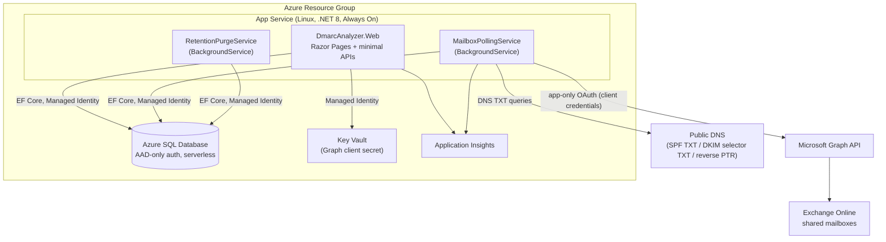
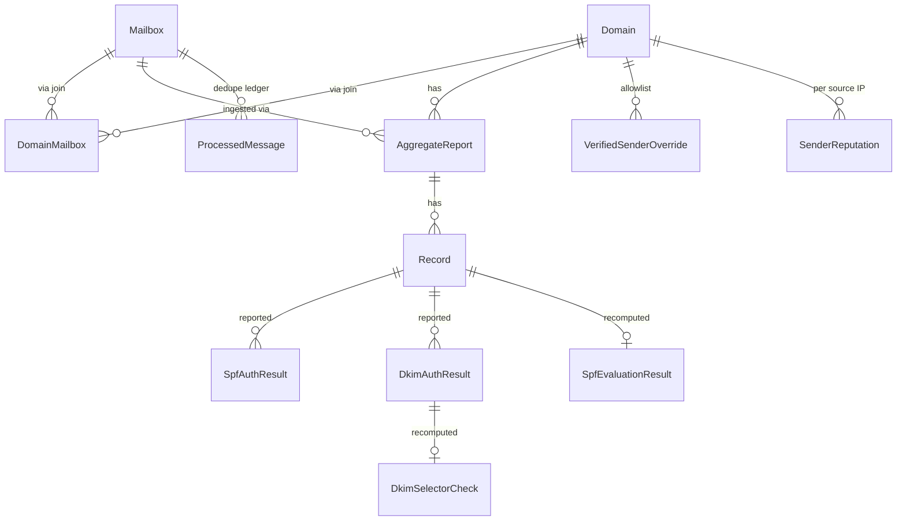
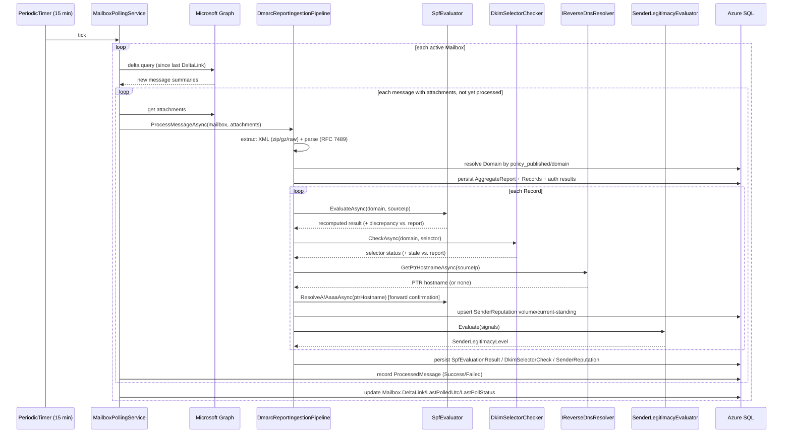

# DMARC Analyzer — Functional & Technical Specification

## 1. Document Overview

| | |
|---|---|
| **Document version** | 1.6 |
| **Date written** | 2026-08-10 (last updated 2026-08-11 — see [§7.4 Change log](#74-change-log)) |
| **Document status** | Final — describes the as-built system on `main` plus this update's pending pull request |
| **Repository** | `TenOfNine/AzureHosted-DMARC-Analyzer` |
| **Scope** | This document specifies the system as implemented. It is a reference for operating, extending, and reviewing the application — not a forward-looking proposal. Where a capability is intentionally out of scope for the current implementation, it is called out explicitly under [§3.7](#37-explicitly-out-of-scope) and [§7.1](#71-glossary). |

This document complements [`README.md`](../README.md) (quick orientation and screenshots) and
[`docs/deployment.md`](./deployment.md) (deployment runbook). It is the detailed reference for
*how the system is built* and *what it guarantees*.

## 2. Feature Overview

### 2.1 Background

DMARC (Domain-based Message Authentication, Reporting & Conformance, RFC 7489) lets a domain
owner publish a policy telling receiving mail servers what to do with messages that fail SPF/DKIM
alignment, and requests daily aggregate reports (RUA) — and optionally per-message forensic
reports (RUF) — describing what was seen. Raw RUA/RUF XML/zip attachments are not
human-readable at scale, and the reports only describe what a receiver saw *at evaluation time*
against whatever SPF/DKIM records existed *then* — they do not tell the domain owner whether a
listed sender is still authorized *today*, since SPF records and DKIM keys change independently
of when reports are generated.

This project was commissioned to replace manual/ad-hoc inspection of RUA/RUF emails landing in an
Exchange Online shared mailbox with a hosted analyzer that (a) ingests and parses those reports
automatically, (b) independently re-verifies each report's claims against the sending domain's
**live** SPF record and DKIM selectors, and (c) presents the result as a dashboard.

### 2.2 Business goals

| ID | Goal |
|---|---|
| G-1 | Eliminate manual handling of DMARC report emails. |
| G-2 | Surface, per sending domain, which source IPs are DMARC-compliant vs. not, over time. |
| G-3 | Detect drift between a report's historical SPF/DKIM verdict and the domain's current DNS state — i.e., catch senders that *used to* be authorized and no longer are, or vice versa. |
| G-4 | Deploy on Azure infrastructure the organization already operates (Germany West Central region), using Exchange Online mailboxes already receiving the reports. |
| G-5 | Make the same codebase deployable as an independent instance per organization, without code changes between deployments. |
| G-6 | Access the shared mailbox(es) using modern, credential-minimal authentication (Entra ID app registration + Microsoft Graph), not legacy/basic auth. |
| G-7 | Ship with automated deployment and CI test coverage rather than a manually-deployed one-off. |

### 2.3 Target users

| Persona | Needs |
|---|---|
| **Messaging/Security administrator** | Reviews domain DMARC health, investigates unverified senders, decides on policy changes (`p=quarantine`/`reject`). |
| **Deploying engineer** | Stands up a new instance of the system for an organization: provisions Azure infrastructure, registers the Entra ID app, runs the setup wizard. |
| **Maintainer/contributor** | Extends the codebase — this document, together with the source tree, is the primary onboarding reference. |

There is currently one implicit role: any user who signs in via the tenant's Entra ID (gated by
Azure App Service Authentication in front of the whole app — see [§5.2](#52-security-requirements))
has full access to the dashboard and settings. There is no in-app role separation between the
messaging/security administrator persona and the deploying engineer — anyone able to sign in can
also reconfigure the Graph connection, domains, and mailboxes.

## 3. Functional Requirements

Requirements are grouped by capability area and tagged with an ID for traceability. All are
**Implemented** in the current codebase unless marked otherwise.

### 3.1 Report ingestion (Microsoft Graph)

| ID | Requirement | Implementation |
|---|---|---|
| FR-ING-1 | The system polls each configured Exchange Online shared mailbox on a recurring interval (default 15 minutes, configurable via `Ingestion:PollIntervalMinutes`) for new messages. | `MailboxPollingService` (`src/DmarcAnalyzer.Infrastructure/Ingestion/MailboxPollingService.cs`), an ASP.NET Core `BackgroundService` using a `PeriodicTimer`. |
| FR-ING-2 | Polling uses Microsoft Graph delta queries so repeated polls only return messages new since the last successful poll; the delta link is persisted per mailbox. | `GraphMailboxClient.ListNewMessagesAsync` (`src/DmarcAnalyzer.Infrastructure/Graph/GraphMailboxClient.cs`); `Mailbox.DeltaLink` column. |
| FR-ING-3 | Graph access uses app-only (client-credentials) OAuth via an Entra ID app registration — no delegated/user login, no legacy basic auth. | `GraphClientFactory` builds a `ClientSecretCredential` per call from the stored Tenant ID/Client ID and the Key-Vault-resident client secret. Required Graph permission: application `Mail.Read`. |
| FR-ING-4 | A message is only processed once. A per-mailbox, per-message dedupe ledger prevents reprocessing on subsequent polls, and a failure on one message never blocks processing of the remaining messages in the same poll cycle. | `ProcessedMessage` entity/table, keyed uniquely on `(MailboxId, GraphMessageId)`; `MailboxPollingService.ProcessSingleMessageAsync` wraps each message in its own try/catch. |
| FR-ING-5 | RUA attachments are accepted as `.zip`, `.gz`, or raw `.xml`; the correct handler is chosen by file extension and the XML is extracted transparently. | `AttachmentExtractor.TryExtractXml` (`src/DmarcAnalyzer.Infrastructure/Ingestion/AttachmentExtractor.cs`). |
| FR-ING-6 | A message with no recognizable DMARC attachment is recorded as **Skipped**, not **Failed**. | `DmarcReportIngestionPipeline.ProcessMessageAsync`. |
| FR-ING-7 | A report is attributed to a monitored `Domain` by the report's own `policy_published/domain` value (case-insensitive match), not by which mailbox it arrived in. A report for a domain not registered in the system is recorded as **Skipped** with the domain name in the reason. | `DmarcReportIngestionPipeline.ProcessMessageAsync`; this is what allows one shared mailbox to receive reports for several domains and a domain's reports to arrive across several mailboxes (see FR-CFG-3). |
| FR-ING-8 | RUF (forensic) attachments are recognized by the extractor but are not deep-parsed in the current implementation (see [§3.7](#37-explicitly-out-of-scope)). | `AttachmentType.Ruf` is defined but not produced by `AttachmentExtractor`; only RUA (zip/gzip/xml) is parsed today. |

### 3.2 DMARC aggregate report parsing

| ID | Requirement | Implementation |
|---|---|---|
| FR-PARSE-1 | Parse an RFC 7489 aggregate ("feedback") report: `report_metadata` (org name, contact email, report ID, date range), `policy_published` (domain, `adkim`/`aspf` alignment mode, `p`/`sp` disposition, `pct`, `fo`), and one or more `record` blocks (source IP, count, policy-evaluated disposition/SPF/DKIM, override reasons, identifiers, `auth_results`). | `DmarcXmlParser.Parse` (`src/DmarcAnalyzer.Core/Dmarc/DmarcXmlParser.cs`), `System.Xml.Linq`-based, no external XML schema dependency. |
| FR-PARSE-2 | Optional fields absent from the XML (`extra_contact_info`, `sp`, `fo`, DKIM `selector`/`human_result`, `envelope_from`/`envelope_to`) do not cause a failure; `pct` defaults to 100 and `adkim`/`aspf` default to relaxed (`r`) when omitted. | `DmarcXmlParser`, `DmarcEnumMapper`. |
| FR-PARSE-3 | Malformed XML, a non-`<feedback>` root element, or a missing *required* field raises a typed, message-specific exception rather than an unhandled crash. | `DmarcParseException`. Caught by the ingestion pipeline and recorded as a **Failed** `ProcessedMessage` with the exception message as the reason. |
| FR-PARSE-4 | Parsed data is persisted relationally: one `AggregateReport` row per report, one `Record` row per `<record>`, and one `SpfAuthResult`/`DkimAuthResult` row per reported auth-result entry. | EF Core entities under `src/DmarcAnalyzer.Core/Entities/`; mapping in `DmarcReportIngestionPipeline.MapReport`. |

### 3.3 SPF verification engine

| ID | Requirement | Implementation |
|---|---|---|
| FR-SPF-1 | For every ingested record, independently resolve the domain's **current** SPF TXT record and evaluate it against the record's source IP — separately from, and not derived from, whatever the report itself claimed. | `SpfEvaluator.EvaluateAsync` (`src/DmarcAnalyzer.Core/Spf/SpfEvaluator.cs`), invoked per record by `DmarcReportIngestionPipeline.EvaluateSpfAsync`. |
| FR-SPF-2 | Evaluation implements RFC 7208 mechanisms `ip4`, `ip6`, `a`, `mx`, `include`, `exists`, `all` (with qualifiers `+`/`-`/`~`/`?`) and the `redirect` modifier; unknown modifiers are ignored per the RFC's extensibility rule, unknown/unsupported mechanisms (including the deprecated `ptr`) resolve to `PermError`. | `SpfEvaluator` — see inline RFC citations in the source. |
| FR-SPF-3 | `include` results are combined per RFC 7208 §5.2: only a `Pass` from the included domain counts as a match; `Fail`/`SoftFail`/`Neutral` fall through to the next mechanism in the *outer* record (not a short-circuit); `None`/`PermError` from the included domain propagates as `PermError`. | `SpfEvaluator.EvaluateDomainAsync`, `include` case. |
| FR-SPF-4 | The total number of mechanisms/modifiers that trigger a DNS lookup (`a`, `mx`, `include`, `exists`, `ptr`, `redirect`) is capped at 10 across the whole recursive evaluation; exceeding it yields `PermError`. | `SpfEvaluator.LookupCounter`, shared across the recursion tree. |
| FR-SPF-5 | Zero SPF TXT records resolves to `None`; more than one resolves to `PermError`. | `SpfEvaluator.EvaluateDomainAsync`. |
| FR-SPF-6 | CIDR containment (`ip4`/`ip6` mechanisms, and matching a resolved `a`/`mx` host address against the checked IP) is computed via manual bitwise prefix comparison, not .NET's `IPNetwork` type — the latter rejects a base address with non-zero host bits, which resolved A/AAAA host addresses routinely have. | `SpfEvaluator.IsInCidr`. (See [§7.3](#73-known-defects-fixed-during-development) — this was a defect found and fixed during development.) |
| FR-SPF-7 | Macro expansion (RFC 7208 §7) is explicitly not implemented; `include`/`redirect`/`exists` arguments are treated as literal domains. | Documented in a code comment on `SpfEvaluator`; see [§3.7](#37-explicitly-out-of-scope). |
| FR-SPF-8 | When the recomputed result disagrees with the record's own `policy_evaluated/spf` verdict, the discrepancy is flagged and persisted with an explanatory note. | `SpfEvaluationResult.DiscrepancyFlag`/`DiscrepancyNote`, computed in `DmarcReportIngestionPipeline.EvaluateSpfAsync`; surfaced in the UI as a **record changed** badge. |

### 3.4 DKIM verification

| ID | Requirement | Implementation |
|---|---|---|
| FR-DKIM-1 | For every reported DKIM auth-result that includes a selector, independently query `{selector}._domainkey.{domain}` and parse the returned key record. | `DkimSelectorChecker.CheckAsync` (`src/DmarcAnalyzer.Core/Dkim/DkimSelectorChecker.cs`). |
| FR-DKIM-2 | Classify the selector as **Valid** (well-formed `p=` tag with valid base64), **Revoked** (empty `p=` tag, per RFC 6376 §3.6.1), **Missing** (no TXT record at all), or **ParseError** (record present but malformed/no `p=` tag). | `DkimSelectorChecker.CheckAsync`. |
| FR-DKIM-3 | If the report claimed a DKIM **Pass** for a selector that is now Missing or Revoked, flag it as stale. | `DkimSelectorCheck.StaleFlag`; surfaced in the UI as a **selector stale** badge. |
| FR-DKIM-4 | Full cryptographic re-verification of the DKIM signature (which would require the original signed message) is explicitly out of scope — aggregate reports carry only pass/fail + selector, not the signature or signed content. | Documented in code comments; see [§3.7](#37-explicitly-out-of-scope). |

### 3.5 Sender legitimacy scoring

Beyond the per-record SPF/DKIM re-checks in §3.3/§3.4, the system maintains a continuously-updated
legitimacy assessment **per (domain, source IP)** — aggregating everything known about that sender
across every report ever ingested for it, not just a single record's data point.

| ID | Requirement | Implementation |
|---|---|---|
| FR-LEGIT-1 | Every time a record is ingested, upsert a per-(domain, source IP) reputation aggregate: cumulative message volume, cumulative DMARC-aligned pass volume, and the timestamps of first/last seen. | `SenderReputation` entity; `DmarcReportIngestionPipeline.UpsertSenderReputationAsync`. |
| FR-LEGIT-2 | The aggregate also carries the *current* standing, refreshed on every new record for that sender: the live-recomputed SPF result (§3.3) and whether any of its DKIM selectors are stale (§3.4) — not a stale copy of the first-ever check. | `SenderReputation.CurrentSpfResult` / `CurrentDkimStale`. |
| FR-LEGIT-3 | Independently of DMARC/SPF/DKIM, perform a reverse-DNS (PTR) lookup for the source IP, and — if a PTR hostname exists — a forward-confirmation check (that hostname's own A/AAAA records resolve back to the same source IP; "FCrDNS"). | `IReverseDnsResolver`/`DnsClientReverseDnsResolver` for the PTR lookup; the forward check reuses `ISpfDnsResolver.ResolveAAsync`/`ResolveAaaaAsync` rather than introducing a duplicate abstraction. |
| FR-LEGIT-4 | Combine all of the above — cumulative aligned-pass ratio, current live SPF result, current DKIM staleness, reverse-DNS presence, forward-confirmation, and an explicit admin allowlist match — into one overall legitimacy verdict: **Verified**, **Likely legitimate**, **Unverified**, or **Suspicious**. The exact rule set is a deliberately conservative, documented heuristic (not a third-party reputation/threat-intelligence lookup, which this system has no access to) — see the XML-doc on `SenderLegitimacyEvaluator` for the full rationale. | `SenderLegitimacyEvaluator.Evaluate` (`src/DmarcAnalyzer.Core/Legitimacy/`), pure and independently unit-tested against 15 scenarios with zero DB/DNS dependency. |
| FR-LEGIT-5 | The domain-detail page presents a dedicated **sender legitimacy** table — one row per source IP ever seen for the domain, independent of the record time-window filter — alongside the existing per-record table, which itself now also carries the same legitimacy verdict per record. | `Pages/Dashboard/DomainDetail.cshtml`, `DomainDetailModel.Senders`. |
| FR-LEGIT-6 | Both the sender-legitimacy table and the per-record table can be filtered by legitimacy level, SPF result, DKIM result, disposition, and a free-text search (source IP, reverse-DNS hostname, or reporting org) — so an administrator can isolate exactly the non-legitimate senders without scanning the full list. | `DomainDetailModel` query-string-bound filter properties (`LegitimacyFilter`, `SpfFilter`, `DkimFilter`, `DispositionFilter`, `Search`), applied server-side. |
| FR-LEGIT-7 | Every column in both tables is sortable by clicking its header (ascending/descending, with a visual indicator), without a full page reload. | `wwwroot/js/sortable-table.js` — a small dependency-free client-side sort over the already-rendered, already-filtered rows; no additional server round-trip. |

### 3.6 Configuration, setup, and multi-instance support

| ID | Requirement | Implementation |
|---|---|---|
| FR-CFG-1 | No tenant-specific configuration (Entra ID app registration, domains, mailboxes, retention) is baked into the deployment template; all of it is entered through an in-app setup wizard after deployment, so the same codebase/template redeploys cleanly for a new organization. | `infra/main.parameters.json` contains only generic knobs (region, naming, SKU, SQL admin identity); `Pages/Setup/*`. |
| FR-CFG-2 | Until Graph connection + ≥1 domain + ≥1 mailbox + retention are all configured, every request except `/Setup/*` is redirected to the setup wizard. | `SetupGateMiddleware` (`src/DmarcAnalyzer.Web/Infrastructure/SetupGateMiddleware.cs`) + `SetupStateService.IsSetupCompleteAsync`. |
| FR-CFG-3 | Domains and shared mailboxes are a many-to-many relationship: one mailbox can serve several domains, and one domain's reports can land in more than one mailbox. All mailboxes authenticate with the *same* app registration credentials — only the mailbox address differs per poll. | `DomainMailbox` join entity; `Pages/Setup/Mailboxes.cshtml` multi-select UI. |
| FR-CFG-4 | The Graph app registration's client secret is validated live (a real Graph call) before being persisted, and is written directly to Azure Key Vault — it is never stored in the SQL database, not even encrypted. Only the Key Vault secret **name** is stored in SQL. | `Pages/Setup/GraphConnection.cshtml.cs`; `GraphConnectionSettings.ClientSecretKeyVaultName`; `KeyVaultSecretStore`. |
| FR-CFG-5 | Data retention is configurable (30–3650 days, default 400) per deployment, not hardcoded. | `Pages/Setup/Retention.cshtml`; `RetentionSettings.RetentionDays`. |
| FR-CFG-6 | The setup-wizard pages remain directly reachable after initial setup and double as the ongoing settings UI (add/remove domains and mailboxes, rotate the Graph client secret, change retention) — there is no separate, duplicated "settings" implementation. | `Pages/Settings/Index.cshtml` links directly to `Pages/Setup/*`. |

### 3.7 Explicitly out of scope

The following are intentional non-goals of the current implementation, called out so they are not
mistaken for defects:

- **Sender legitimacy scoring is a heuristic, not threat intelligence** — `SenderLegitimacyEvaluator`
  (§3.5) combines signals this system can compute for itself (report history, live SPF/DKIM,
  reverse DNS). It has no access to, and does not call out to, any third-party IP/domain reputation
  or threat-intelligence service. "Suspicious" means "worth an administrator's attention," not "confirmed malicious."
- **RUF (forensic report) content parsing** — attachments are recognized but not parsed; only RUA
  (aggregate) reports drive the dashboard and analysis.
- **SPF macro expansion** (RFC 7208 §7) — `%{i}`-style macros in `exists`/`include`/`redirect`
  arguments are treated as literal text, not expanded. This covers the large majority of
  real-world SPF records; a macro-using record will simply fail to match rather than
  mis-evaluate silently.
- **DKIM cryptographic signature re-verification** — only DNS-selector liveness is checked, not
  the signature itself (requires the original signed message, which aggregate reports don't
  carry).
- **Raw report/email storage** — only parsed relational fields are stored; raw XML/attachment
  bytes are not persisted (keeps the database small on a serverless SQL tier; a future
  Blob-Storage-backed "replay" feature is a documented possibility, not implemented).
- **Multi-tenant single deployment** — one deployed instance serves one organization's Entra ID
  tenant and domains; running multiple unrelated customers behind one deployment is not
  supported (by design — see FR-CFG-1).
- **User authentication/authorization within the app** — see [§5.2](#52-security-requirements).

## 4. System Design

### 4.1 Architecture

**Project layout** (`src/`, `tests/`, `tools/`, `infra/`):

| Project | Responsibility | External dependencies |
|---|---|---|
| `DmarcAnalyzer.Core` | RFC 7489 XML parsing, RFC 7208 SPF evaluation, DKIM selector checking, sender-legitimacy scoring, entity definitions, DI-facing abstractions (`ISpfDnsResolver`, `IDkimDnsResolver`, `IReverseDnsResolver`, `IGraphMailboxClient`, `ISecretStore`, `ISetupStateService`). | **None** — no EF Core, Graph SDK, or Azure SDK reference. This is what makes it fully unit-testable offline. |
| `DmarcAnalyzer.Infrastructure` | EF Core `DbContext` + configurations + migrations, Graph client (`Microsoft.Graph` SDK v6), Key Vault client (`Azure.Security.KeyVault.Secrets`), DNS resolution (`DnsClient.NET`), the two background services, the ingestion pipeline. | EF Core SqlServer, Microsoft.Graph, Azure.Identity, Azure.Security.KeyVault.Secrets, DnsClient. |
| `DmarcAnalyzer.Web` | ASP.NET Core 8 Razor Pages host: setup wizard, dashboard, settings, chart-data minimal API, DI composition root (`Program.cs`). | References Infrastructure + Core; adds `Microsoft.ApplicationInsights.AspNetCore`. |
| `tests/DmarcAnalyzer.Tests` | xUnit tests against in-memory fakes (`FakeSpfDnsResolver`, `FakeDkimDnsResolver`, `FakeGraphMailboxClient`) and EF Core's InMemory provider. No network access required. | xunit, Microsoft.EntityFrameworkCore.InMemory. |
| `tools/GrantSqlAccess` | Deploy-time console utility: grants the Web App's managed identity a SQL database user (Bicep cannot create database users). | Microsoft.Data.SqlClient. |
| `infra/` | Bicep IaC: `main.bicep` + `modules/{appServicePlan,webApp,sqlServer,keyVault,monitoring}.bicep`. | — |

**Dependency direction** is strictly `Web → Infrastructure → Core`; `Core` never depends outward.
This is enforced by project references, not just convention, and is what lets ~75% of the
business-logic test suite ([§6](#6-verification-and-acceptance-evidence)) run with zero network or
Azure dependency.

### 4.2 Data design

All entities live in `DmarcAnalyzer.Core.Entities`; EF Core mapping (`IEntityTypeConfiguration<T>`)
lives in `DmarcAnalyzer.Infrastructure.Data.Configurations`. Table names match entity names unless
noted.

| Entity (table) | Key fields | Notes |
|---|---|---|
| `Domain` (`Domains`) | `DomainName` (unique), `IsActive` | A monitored sending domain. |
| `Mailbox` (`Mailboxes`) | `MailboxUpn` (unique), `MailFolder`, `DeltaLink`, `LastPolledUtc`, `LastPollStatus`, `LastPollError` | A polled shared mailbox. `MailFolder` accepts a well-known folder name (e.g. `inbox`) or a raw Graph folder ID — arbitrary folder-name resolution is not implemented. |
| `DomainMailbox` (`DomainMailboxes`) | composite PK `(DomainId, MailboxId)` | Many-to-many join; both FKs cascade-delete. |
| `GraphConnectionSettings` | singleton row, `Id = 1` | `TenantId`, `ClientId`, `ClientSecretKeyVaultName` (pointer only — the secret value lives in Key Vault), validation status. |
| `RetentionSettings` | singleton row, `Id = 1` | `RetentionDays` (default 400), `LastPurgeRunUtc`, `LastPurgeRowsDeleted`. |
| `ProcessedMessage` (`ProcessedMessages`) | unique index `(MailboxId, GraphMessageId)` | Idempotency ledger: `Status` (Success/Skipped/Failed), `AttachmentType`, `FailureReason`. |
| `DmarcAggregateReport` (`AggregateReports`) | FK `DomainId` (cascade delete), FK `MailboxId` (**restrict** — a mailbox can be deactivated/removed without needing to decide what happens to reports it already ingested) | `report_metadata` + `policy_published` fields; indexed on `(DomainId, DateRangeEndUtc)` for dashboard trend queries. |
| `DmarcRecord` (`Records`) | FK `AggregateReportId` (cascade) | One `<record>` per row: `SourceIp`, `Count`, `PolicyEvaluatedDisposition/Dkim/Spf`, identifiers. |
| `SpfAuthResult` / `DkimAuthResult` | FK `DmarcRecordId` (cascade) | As reported by the receiving mail server (`auth_results/spf`, `auth_results/dkim`). |
| `SpfEvaluationResult` | 1:1 with `DmarcRecord` (cascade) | The **independently recomputed** SPF verdict — `RecomputedResult`, `MatchedMechanism`, `LookupCount`, `DiscrepancyFlag`/`Note`. |
| `DkimSelectorCheck` | 1:1 with `DkimAuthResult` (cascade) | The **independently recomputed** DKIM selector liveness — `Status`, `RawTxtRecord`, `StaleFlag`. |
| `VerifiedSenderOverride` | FK `DomainId` (cascade) | Admin-curated allowlist entry (CIDR and/or org-name pattern) — one of the inputs to `SenderLegitimacyEvaluator` (§3.5). |
| `SenderReputation` | FK `DomainId` (cascade), unique index `(DomainId, SourceIp)` | The per-(domain, source IP) legitimacy aggregate (§3.5): `TotalVolume`, `AlignedPassVolume` (`AlignedPassRatio` is a `[NotMapped]` computed property over these two), `CurrentSpfResult`, `CurrentDkimStale`, `ReverseDnsHostname`, `ForwardConfirmed`, `IsOverrideMatch`, `LegitimacyLevel`, `FirstSeenUtc`/`LastSeenUtc`/`LastEvaluatedUtc`. Upserted — not append-only — so it always reflects current, not historical, standing. |

Enumerations (`DmarcAnalyzer.Core.Entities.Enums`): `DmarcDisposition`, `DmarcAlignmentMode`,
`DmarcPolicyResult`, `SpfScope`, `SpfResultCode`, `DkimResultCode`, `MessageProcessingStatus`,
`AttachmentType`, `MailboxPollStatus`, `DkimSelectorStatus`, `SenderLegitimacyLevel` (`Verified` →
`LikelyLegitimate` → `Unverified` → `Suspicious`, ordered most to least trustworthy — the ordinal
value is used directly as the sort key for the Legitimacy column in the UI).

### 4.3 Interface design

#### 4.3.1 Page routes (Razor Pages)

| Route | Purpose |
|---|---|
| `/` | Redirects to `/Dashboard`. |
| `/Dashboard` | Domain overview cards (30-day volume, pass rate, last report). |
| `/Dashboard/DomainDetail?domainId=&Days=&LegitimacyFilter=&SpfFilter=&DkimFilter=&DispositionFilter=&Search=` | Per-domain trend chart, sender-legitimacy table, and per-record table — both tables filterable by the query-string parameters shown and independently sortable client-side (§3.5, FR-LEGIT-5–7). |
| `/Settings` | Hub linking to all configuration areas below. |
| `/Settings/IngestionStatus` | Per-mailbox poll status/error, retention job status, recent processing failures. |
| `/Setup/Welcome`, `/Setup/GraphConnection`, `/Setup/Domains`, `/Setup/Mailboxes`, `/Setup/Retention`, `/Setup/Review` | First-run wizard; also the ongoing settings pages for these areas (see FR-CFG-6). |

#### 4.3.2 Minimal API

| Endpoint | Purpose |
|---|---|
| `GET /api/domains/{domainId}/trend?days=30` | Returns `[{ date, pass, fail }]` daily aggregated volume for the domain-detail Chart.js chart. Implemented in `src/DmarcAnalyzer.Web/Api/ChartDataEndpoints.cs`. |

#### 4.3.3 External interfaces

| Interface | Direction | Auth | Notes |
|---|---|---|---|
| Microsoft Graph (`graph.microsoft.com`) | Outbound | App-only OAuth 2.0 client-credentials (`ClientSecretCredential`), scope `https://graph.microsoft.com/.default` | Requires the `Mail.Read` **application** permission, admin-consented; recommended to be scoped via an Exchange Online Application Access Policy (see [`docs/exchange-application-access-policy.md`](./exchange-application-access-policy.md)) since application permissions are otherwise tenant-wide. |
| Public DNS | Outbound | None | TXT queries for SPF (domain apex and any `include`d domains) and DKIM selector records, via `DnsClient.NET`'s system-resolver-backed `LookupClient`. |
| Azure Key Vault | Outbound | Managed Identity (`DefaultAzureCredential`) | `GetSecretAsync`/`SetSecretAsync` for the Graph client secret only. |
| Azure SQL | Outbound | Managed Identity (`Authentication=Active Directory Managed Identity` connection string) | No SQL password anywhere in the system. |

### 4.4 Ingestion & analysis pipeline (sequence)

### 4.5 Infrastructure (Bicep)

| Resource | Configuration | File |
|---|---|---|
| App Service Plan | Linux, SKU `B1` (parameterized, must support Always On) | `infra/modules/appServicePlan.bicep` |
| Web App | `.NET 8`, system-assigned managed identity, `alwaysOn: true`, HTTPS-only, TLS ≥ 1.2 | `infra/modules/webApp.bicep` |
| Azure SQL | Logical server with **Azure-AD-only authentication** (no SQL password path exists), database SKU `GP_S_Gen5` (General Purpose, serverless), capacity 1, `autoPauseDelay: 60` min, `minCapacity: 0.5` vCore | `infra/modules/sqlServer.bicep` |
| Key Vault | RBAC authorization (not access policies), soft-delete + purge protection enabled | `infra/modules/keyVault.bicep` |
| Monitoring | Log Analytics workspace + workspace-based Application Insights | `infra/modules/monitoring.bicep` |
| Role assignment | Web App managed identity granted **Key Vault Secrets Officer**, scoped to the Key Vault resource only | `infra/main.bicep` |

Default region: `germanywestcentral`. All resource names are derived from a `namePrefix` parameter
plus `uniqueString(resourceGroup().id, ...)`, so the same template redeploys cleanly into a fresh
resource group for a new organization without name collisions (supports G-5/FR-CFG-1).

### 4.6 CI/CD

| Workflow | Trigger | Steps |
|---|---|---|
| `.github/workflows/ci.yml` | Pull request → `main`, push → `main` | `dotnet restore` → `dotnet build -c Release` → `dotnet format --verify-no-changes` → `dotnet test` (with coverage collection) → upload test results artifact. No Azure credentials used or needed. |
| `.github/workflows/codeql.yml` | Pull request → `main`, push → `main`, weekly schedule | `github/codeql-action` static analysis for C#, uploaded to the repository's Security tab. |
| `.github/workflows/dependency-review.yml` | Pull request → `main` | `actions/dependency-review-action` fails the check on newly introduced dependencies with high-severity vulnerability advisories. |
| `.github/workflows/deploy.yml` | `workflow_run` after CI succeeds on `main`, or manual `workflow_dispatch` | `azure/login` via **OIDC federated credentials** (no stored client secret) → Bicep deploy (`azure/arm-deploy`) → grant the Web App's managed identity DB access (`tools/GrantSqlAccess`, using `Authentication=Active Directory Default`) → build + apply an EF Core migrations bundle → `dotnet publish` → `azure/webapps-deploy`. |

## 5. Non-Functional Requirements

### 5.1 Performance requirements

| ID | Requirement |
|---|---|
| NFR-PERF-1 | Mailbox polling interval is configurable (default 15 min); DMARC aggregate reports are typically sent once daily per reporting organization per domain, so this comfortably keeps up without needing elastic scaling. |
| NFR-PERF-2 | The SPF/DKIM lookup limit (10, per RFC 7208) bounds the DNS work per record to a small, fixed number of queries. |
| NFR-PERF-3 | Retention purge runs in batches of 500 rows per delete statement (`RetentionPurgeService`) to avoid a single long-running transaction against the serverless SQL tier. |
| NFR-PERF-4 | The Azure SQL tier auto-pauses after 60 minutes of inactivity (cost control); the first request after a pause incurs a resume latency, which is an accepted tradeoff for a low-traffic internal tool. |
| NFR-PERF-5 | Sender-legitimacy scoring adds up to two DNS lookups per record (a PTR lookup, plus a forward A/AAAA lookup only when the PTR resolves) on top of the existing SPF/DKIM lookups — bounded per-record, not per-poll, so it scales with report volume the same way the existing SPF/DKIM checks already do. A within-report cache (keyed by source IP) avoids repeating the same sender's DNS work twice when one report lists it more than once. |

### 5.2 Security requirements

| ID | Requirement |
|---|---|
| NFR-SEC-1 | No password-based authentication exists anywhere in the credential chain: Graph access is app-only OAuth, SQL access is Azure AD-only (Managed Identity for the app; the deploy pipeline's own AAD-admin identity for migrations), Key Vault access is Managed Identity via RBAC. |
| NFR-SEC-2 | The Graph app registration's client secret is written directly to Key Vault by the setup wizard and is never persisted in SQL, logs, or source control. |
| NFR-SEC-3 | GitHub Actions authenticates to Azure via OIDC federated credentials; no long-lived Azure secret is stored as a GitHub secret. |
| NFR-SEC-4 | The Graph application permission (`Mail.Read`) is tenant-wide by default; the system documents (does not itself automate) scoping it to only the configured shared mailboxes via an Exchange Online Application Access Policy — see `docs/exchange-application-access-policy.md`. |
| NFR-SEC-5 | The Web App is gated behind Microsoft Entra ID sign-in via Azure App Service Authentication ("Easy Auth" v2, `infra/modules/webApp.bicep`'s `authsettingsV2` resource) — enforced at the platform level, in front of every request including the setup wizard, so no application code implements or can accidentally bypass login. `enableEntraIdAuth` defaults to `true`; disabling it is only appropriate when the app sits behind some other equivalent access control (private network, gateway auth) and must be a deliberate, documented choice per deployment. This closes what was previously an accepted gap (see §7.4 v1.4 change log) — the single most consequential hardening step for any deployment reachable outside a fully trusted network. |
| NFR-SEC-6 | Raw report/email content is not stored (see [§3.7](#37-explicitly-out-of-scope)), limiting the blast radius of a database compromise to metadata (source IPs, volumes, org names) rather than message content. |
| NFR-SEC-7 | Every response carries a restrictive Content-Security-Policy (`default-src 'self'`, nonce-based `script-src`, no framing, no external origins — nothing is loaded from a CDN, everything under `wwwroot/lib` is vendored), plus `X-Content-Type-Options: nosniff`, `X-Frame-Options: DENY`, `Referrer-Policy: strict-origin-when-cross-origin`, and a locked-down `Permissions-Policy` (`SecurityHeadersMiddleware`). The Kestrel `Server` header is suppressed. |
| NFR-SEC-8 | The DMARC report XML parser explicitly blocks DOCTYPE processing (`XmlReaderSettings.DtdProcessing = Prohibit`, `XmlResolver = null`) before parsing — reporting organizations are arbitrary third parties on the internet, so this is untrusted input; the setting blocks both XXE (external entity resolution) and "billion laughs" (internal entity expansion) rather than relying on the implicit (already-safe) `XmlReader` defaults. |
| NFR-SEC-9 | Zip/gzip attachment extraction is bounded to 50 MB of actual decompressed bytes (`AttachmentExtractor.CopyWithLimit`), enforced by counting bytes copied rather than trusting the archive's declared (attacker-controlled) size — the shared mailbox accepts attachments from arbitrary senders, so a small, highly-compressible payload could otherwise decompress into a memory-exhaustion DoS. |
| NFR-SEC-10 | Every Bicep-deployed resource carries common tags (`application`, `environment`, `managedBy`) for asset inventory and governance. |
| NFR-SEC-11 | App Service HTTP/console/platform logs, Key Vault audit events, and SQL security audit events are all routed to the existing Log Analytics workspace (`diagnosticSettings` resources in `webApp.bicep`/`keyVault.bicep`/`sqlServer.bicep`) — previously only Application Insights telemetry existed; this adds platform-level audit trails for who/what touched the Graph client secret and the database. |
| NFR-SEC-12 | Azure SQL automatic backups use zone- (not geo-) redundant storage (`requestedBackupStorageRedundancy: 'Zone'`) — resilient to a zone failure without replicating backup data outside the deployment region, consistent with the project's Germany West Central default being a deliberate data-residency choice, not just a latency one. |
| NFR-SEC-13 | `.github/workflows/secret-scan.yml` scans every push/PR for committed secrets using the open-source gitleaks CLI (not the `gitleaks-action` wrapper, which requires a paid license for organization-owned repos) — a defense-in-depth backstop independent of whether GitHub's own native secret scanning is enabled for the repository. |

#### 5.2.1 Microsoft Cloud Security Benchmark alignment

A review against the [Microsoft Cloud Security Benchmark](https://learn.microsoft.com/en-us/security/benchmark/azure/overview) (MCSB) — prompted by a repository review, not a compliance mandate — turned up the controls above (NFR-SEC-5, NFR-SEC-7–13 map to IM-1/IM-2, LT-1/LT-3/LT-4, DP-1, BR-1, and DS-6 respectively) plus a few whose full implementation is a deliberate, larger tradeoff left for the deploying organization to opt into rather than something this template forces on every customer:

| MCSB control | What it recommends | Why it's not applied here by default |
|---|---|---|
| NS-2 (private endpoints / disable public network access) | Put the Web App, SQL server, and Key Vault behind Private Link, reachable only from a VNet. | Requires a Premium App Service plan and VNet integration — a materially larger cost and operational footprint than the B1 + serverless-SQL setup this template targets for a small-to-mid-size customer's DMARC monitoring. Worth reconsidering if a deployment's threat model requires it; the SQL firewall already restricts inbound access to "Azure services" only, not the open internet, as a partial mitigation. |
| DP-5 (customer-managed encryption keys) | Encrypt SQL/Key Vault/Storage with keys you hold and rotate, instead of Microsoft-managed keys. | Azure's platform-managed encryption at rest already covers this system's threat model (no regulatory driver identified for the DMARC use case); CMK adds a second Key Vault, key-rotation operations, and a new availability dependency for comparatively little benefit here. |
| Defender for Cloud plans (App Service, SQL, Key Vault) | Subscription-level threat protection and posture recommendations. | Defender plans are enabled per-subscription, not per-resource-group, so they sit outside what a resource-group-scoped Bicep template can (or should) toggle on someone else's behalf — and they carry their own per-resource hourly cost. Documented here as a recommendation for the deploying engineer to evaluate and enable at the subscription level if desired. |
| IM-3 (Conditional Access / MFA on the sign-in app) | Require MFA and/or a Conditional Access policy for the Easy Auth sign-in App Registration. | Conditional Access requires Entra ID P1/P2 licensing, which not every tenant has; NFR-SEC-5's Easy Auth gate is the baseline this template guarantees, and the deploying organization's own tenant-wide Conditional Access policies (if any) already apply on top of it for any app requiring sign-in — nothing in this template needs to duplicate that. |

#### 5.2.2 OpenSSF Scorecard notes

`scorecard.yml` runs the [OpenSSF Scorecard](https://github.com/ossf/scorecard) against this
repository weekly and on every push to `main`, publishing results to the public Scorecard API/badge
(appropriate since this repository is public) and to GitHub's own code-scanning dashboard. One
clarification worth recording: a Scorecard result surfaced in a pull request's automated
dependency-review comment reports on the *dependencies introduced by that PR* (e.g. `actions/checkout`,
a GitHub-owned action) — not on this repository itself. `scorecard.yml` is what actually assesses
*this* repo, and is the source for the README badge.

A few checks are expected to score low here, by design rather than oversight:

- **Token-Permissions** — every workflow in `.github/workflows/` already declares an explicit,
  least-privilege `permissions:` block (verified during this review); this check should score well.
- **CII Best Practices** — this is the [OpenSSF Best Practices badge](https://www.bestpractices.dev/),
  earned by the project maintainer completing a self-assessment questionnaire on bestpractices.dev.
  It requires an ongoing commitment from whoever registers as the project owner and can't be
  completed on the maintainer's behalf via a pull request.
- **Fuzzing** — Scorecard only recognizes a small set of specific integrations (OneFuzz, ClusterFuzzLite,
  Go's native fuzzing, OSS-Fuzz, property-based Haskell testing). None practically fit a C#/.NET
  project today: OneFuzz is archived, ClusterFuzzLite doesn't support C#, and OSS-Fuzz has no
  meaningful .NET track. The DMARC XML parser's actual fuzzing-relevant attack surface (malformed
  XML, XXE, decompression bombs) is instead covered by targeted unit tests (NFR-SEC-8/9) rather
  than a generic fuzz harness.
- **Packaging** and **Signed-Releases** — both assume the project publishes versioned package
  artifacts (to a registry like npm/NuGet/a container registry) via tagged GitHub Releases. This
  project is deployed continuously from `main` straight to Azure App Service (§4.6) rather than
  published as a versioned package, so neither applies to its current shape. Introducing a
  container image and/or a formal release process was considered and explicitly deferred (adds
  versioning/changelog discipline with no identified consumer need today) — worth revisiting if the
  project ever needs to be distributed outside its own CI/CD pipeline.

### 5.3 Usability requirements

| ID | Requirement |
|---|---|
| NFR-USE-1 | A fresh deployment is unusable until first-run setup is complete, and is redirected there automatically rather than presenting a broken/empty dashboard. |
| NFR-USE-2 | The dashboard surfaces a four-tier legitimacy badge (Verified/Likely legitimate/Unverified/Suspicious, §3.5) plus the two independent-verification signals (SPF record drift, stale DKIM selector) as inline badges directly in the record and sender-legitimacy tables, not buried in a separate report. |
| NFR-USE-3 | The UI style is a self-contained, brand-neutral dashboard aesthetic (teal/slate palette, card-based domain overview, Chart.js trend visualization) modeled loosely on commercial DMARC dashboards (dmarcian-style), implemented with vendored Bootstrap + Chart.js — no CDN dependency at runtime. |
| NFR-USE-4 | Finding non-legitimate senders does not require scanning the full record list: the legitimacy filter (FR-LEGIT-6) isolates them directly, and every column remains sortable (FR-LEGIT-7) for ad-hoc investigation without a page reload. |

### 5.4 Reliability requirements

| ID | Requirement |
|---|---|
| NFR-REL-1 | A single message's ingestion failure (parse error, transient Graph/DNS error) is isolated and does not abort the rest of that poll cycle's batch (FR-ING-4). |
| NFR-REL-2 | Both background services (`MailboxPollingService`, `RetentionPurgeService`) catch and log unexpected exceptions at the top of their loop rather than letting an unhandled exception terminate the hosted service. |
| NFR-REL-3 | The App Service Plan is expected to run as a **single instance** (no autoscale) for this workload — the background services hold no distributed lock, so multi-instance scale-out would risk duplicate polling/purging. This is a documented limitation, not enforced in code or infrastructure. |

### 5.5 Portability / redeployability requirements

| ID | Requirement |
|---|---|
| NFR-PORT-1 | The Bicep template accepts only generic parameters (environment name, region, name prefix, SKU, SQL admin identity) — see FR-CFG-1. |
| NFR-PORT-2 | Standing up a second, independent instance for a different organization requires no source changes — only a new resource group, a new Entra ID app registration, and re-running the setup wizard. |

## 6. Verification and Acceptance Evidence

This section records what has actually been verified against the implementation, as evidence for
the acceptance criteria in [§6.1](#61-acceptance-criteria).

- **Automated test suite**: 65 xUnit tests, all passing (`dotnet test`), covering:
  - `SpfEvaluatorTests` (18 tests): CIDR boundary correctness (ip4/ip6), all four `all`-qualifier
    outcomes, two-level nested `include` with correct non-short-circuit fallthrough, an `include`
    target with no record, the `redirect` modifier, `a`/`mx` with and without explicit
    domain-spec/CIDR, `exists`, exceeding the 10-lookup limit, multiple SPF records, no SPF
    record, an unrecognized mechanism, an unrecognized-but-ignored modifier, mechanism-keyword
    case-insensitivity.
  - `DkimSelectorCheckerTests` (5 tests): valid key, revoked (empty `p=`), missing record, no
    `p=` tag, garbage base64.
  - `DmarcXmlParserTests` (6 tests) and `AttachmentExtractorTests` (6 tests): full/minimal valid
    reports, malformed XML, a missing required field, a non-`<feedback>` root, a DOCTYPE declaration
    (XXE/entity-expansion) rejection, zip/gzip/raw-xml attachment-extraction equivalence, and the
    decompression-bomb size-limit guard for both zip and gzip.
  - `MailboxPollingServiceTests` (2 tests): a message is not reprocessed on a second poll; one
    malformed message does not block a subsequent valid one in the same batch.
  - `SenderLegitimacyEvaluatorTests` (15 tests): the override-match short-circuit, the Verified
    threshold (including the exact boundary value), historical-pass-ratio-vs-live-SPF drift
    dropping a sender out of Verified, DKIM staleness doing the same, the LikelyLegitimate paths
    (moderate ratio / live SPF pass alone / forward-confirmation alone), Suspicious vs. Unverified
    hinging on reverse-DNS presence, and every non-`Pass` SPF result failing to reach Verified.
  - `SenderReputationAggregationTests` (6 tests): a new source IP creates a correctly-aggregated
    row; volume accumulates correctly across two separate messages for the same sender; a
    consistently-passing sender with a valid DKIM key scores Verified end-to-end through the real
    pipeline; a failing sender with no reverse DNS scores Suspicious; the same sender is upgraded
    to LikelyLegitimate once a forward-confirmed PTR is introduced; an admin override forces
    Verified regardless of SPF result.
- **Infrastructure validation**: `infra/main.bicep` compiles and lints cleanly with the Bicep CLI
  (v0.46.1; 0 errors, 0 warnings) — all 5 modules, the new `authsettingsV2` Easy Auth resource, and
  the Key Vault role assignment resolve correctly.
- **End-to-end UI verification**: the running application (seeded with representative sample data,
  not a live Azure/Graph tenant) was exercised via a headless-browser pass covering the dashboard,
  domain-detail page (sender-legitimacy table, per-record legitimacy badges, discrepancy/stale
  badges, and — interactively — clicking a column header to confirm client-side sorting and
  applying the legitimacy filter to confirm both tables narrow correctly), settings hub,
  domains/mailboxes configuration, ingestion status, and setup wizard — see the screenshots in
  `README.md`. Re-verified after the security-hardening pass: response headers (CSP with a
  per-request nonce, `X-Content-Type-Options`, `X-Frame-Options`, `Referrer-Policy`,
  `Permissions-Policy`) are present on every route, and the domain-detail trend chart (the app's one
  inline `<script>` block) still renders with zero browser console/CSP errors under the new policy.
- **Workflow syntax**: both GitHub Actions workflow files were parsed and validated as well-formed
  YAML.

Verification **not** performed (requires live Azure/Microsoft 365 infrastructure this project does
not have access to): an actual deployment to Azure, a live Graph mailbox poll against a real
tenant, and an actual CI/CD run of `deploy.yml` end-to-end. These are called out in
`docs/deployment.md` as the deploying engineer's first post-clone verification steps.

### 6.1 Acceptance criteria

| Category | Criterion | Status |
|---|---|---|
| Functional | All requirements in [§3](#3-functional-requirements) are implemented and covered by at least one automated test or a documented manual verification. | Met — see evidence above. |
| Functional | A DMARC report for an unmonitored domain is skipped, not treated as an error. | Met (FR-ING-7; covered indirectly by the domain-resolution logic, exercised by `MailboxPollingServiceTests`). |
| Performance | `dotnet build`/`dotnet test` complete in CI without network access. | Met — no test in the suite makes a real network call. |
| Security | No plaintext secret (Graph client secret, SQL password) exists in source control, database rows, or GitHub Actions configuration. | Met by design (FR-CFG-4, NFR-SEC-1–3); SQL has no password path at all. |
| Reliability | A single bad message does not abort a poll cycle. | Met — `MailboxPollingServiceTests.PollOnceAsync_OneFailingMessage_DoesNotBlockTheRestOfTheBatch`. |
| Reliability | A poll/purge cycle failure is logged, not fatal to the process. | Met by construction (`try/catch` around each `BackgroundService` loop body) — not covered by an automated test (would require simulating a hosted-service crash), flagged as a documentation-only acceptance item. |
| Portability | The Bicep template contains no hardcoded tenant-specific value. | Met — verified by inspection of `infra/main.parameters.json` and all `infra/*.bicep` files. |
| Functional | Filtering the domain-detail page by legitimacy level narrows both the sender-legitimacy table and the per-record table to only matching rows. | Met — verified interactively via headless browser (filter applied to `Suspicious`, both tables collapsed correctly; see README screenshots) and by the server-side filter logic in `DomainDetailModel.OnGetAsync`. |
| Functional | Every table column responds to a header click by sorting the currently-visible rows, toggling direction on repeated clicks, without a server round-trip. | Met — verified interactively via headless browser (see README screenshots); `sortable-table.js` operates purely client-side over already-rendered DOM rows. |

## 7. Appendix

### 7.1 Glossary

| Term | Meaning |
|---|---|
| **DMARC** | Domain-based Message Authentication, Reporting & Conformance (RFC 7489). |
| **SPF** | Sender Policy Framework (RFC 7208) — a DNS TXT record listing hosts authorized to send mail for a domain. |
| **DKIM** | DomainKeys Identified Mail (RFC 6376) — cryptographic email signing, keys published as DNS TXT records under `{selector}._domainkey.{domain}`. |
| **RUA** | DMARC *aggregate* report — daily XML summary of authentication results, the only report type this system parses today. |
| **RUF** | DMARC *forensic* report — per-message failure detail; recognized but not parsed by this system. |
| **Alignment** (`adkim`/`aspf`) | Whether SPF/DKIM must match the `From:` domain exactly (`s` = strict) or allow an organizational-domain match (`r` = relaxed). |
| **Disposition** (`p`/`sp`) | The policy action requested for the domain (`none`/`quarantine`/`reject`); `sp` is the subdomain policy. |
| **Discrepancy** (this system's term) | A record whose live-recomputed SPF result disagrees with what the aggregate report itself claimed for that source IP. |
| **Stale selector** (this system's term) | A DKIM selector the report recorded as passing, which no longer resolves or has been revoked in DNS today. |
| **Application Access Policy** | An Exchange Online control restricting which mailboxes a given Graph app registration's application permissions can reach. |
| **Sender legitimacy** (this system's term) | The overall Verified/Likely legitimate/Unverified/Suspicious verdict `SenderLegitimacyEvaluator` computes per (domain, source IP) — see §3.5. Distinct from a single record's own SPF/DKIM pass/fail: it's a cumulative, continuously-updated assessment of that sender specifically. |
| **PTR record / reverse DNS** | A DNS record mapping an IP address back to a hostname (the inverse of the usual A/AAAA lookup), queried via the special `in-addr.arpa`/`ip6.arpa` zones. |
| **FCrDNS** | Forward-Confirmed reverse DNS — a PTR lookup's hostname result is considered confirmed only if that hostname's own A/AAAA records resolve back to the original IP. Used here as one signal (not a hard requirement) toward the Verified/Likely legitimate tiers. |

### 7.2 Reference documents

- RFC 7489 — Domain-based Message Authentication, Reporting, and Conformance (DMARC)
- RFC 7208 — Sender Policy Framework (SPF) for Authorizing Use of Domains in Email
- RFC 6376 — DomainKeys Identified Mail (DKIM) Signatures
- [`README.md`](../README.md) — orientation, architecture summary, UI screenshots
- [`docs/deployment.md`](./deployment.md) — deployment runbook
- [`docs/exchange-application-access-policy.md`](./exchange-application-access-policy.md) — Exchange Online PowerShell steps

### 7.3 Known defects fixed during development

Recorded here for traceability, since both were substantive correctness bugs caught by the
automated test suite before merge, not merely style issues:

1. **SPF CIDR matching crash**: .NET 8's `System.Net.IPNetwork` constructor throws if the base
   address has non-zero bits past the prefix length — which a resolved A/AAAA host address
   routinely has. Replaced with a manual bitwise prefix comparison (`SpfEvaluator.IsInCidr`).
2. **EF Core change-tracking bug**: new `SpfEvaluationResult`/`DkimSelectorCheck` entities,
   assigned only via a navigation property on an already-tracked parent with a pre-set
   (non-default) `Guid` key, were misidentified as `Modified` instead of `Added` by EF Core's
   change-tracker graph traversal, causing a `DbUpdateConcurrencyException` on save. Fixed by
   explicitly adding both entities to their `DbSet` in `DmarcReportIngestionPipeline`.

### 7.4 Change log

| Version | Date | Change |
|---|---|---|
| 1.0 | 2026-08-10 | Initial specification, describing the system as of commit `844b4ac`. |
| 1.1 | 2026-08-10 | Added §3.5 Sender legitimacy scoring (FR-LEGIT-1–7): the `SenderReputation` aggregate, `SenderLegitimacyEvaluator` heuristic, reverse-DNS/FCrDNS check, the domain-detail page's sender-legitimacy table, and cross-cutting filter/sort capability on both detail tables. Renumbered the former §3.5/§3.6 to §3.6/§3.7 accordingly. Retired the standalone `IVerifiedSenderClassifier` abstraction and its two-state Verified/Unverified badge — superseded by the four-tier legitimacy verdict everywhere it was used; its override-matching logic survives as `SenderOverrideMatcher`. Updated data model, architecture/sequence diagrams, NFRs, and verification evidence (41 → 62 tests) accordingly. |
| 1.2 | 2026-08-10 | Relicensed the project under the PolyForm Noncommercial License 1.0.0 (`LICENSE`) — noncommercial use, modification, and self-hosting permitted; commercial resale requires a separate agreement. Added two CI/CD checks (§4.6): `codeql.yml` (CodeQL static analysis for C#, on every PR/push plus a weekly schedule) and `dependency-review.yml` (fails PRs introducing high-severity vulnerable dependencies). Added a README Testing section documenting current pass/fail results and status badges. |
| 1.3 | 2026-08-10 | Bumped `actions/checkout` (v4→v5), `actions/setup-dotnet` (v4→v5), `actions/upload-artifact` (v4→v6), `github/codeql-action` (v3→v4), `actions/dependency-review-action` (v4→v5), and `azure/login` (v2→v3) across all workflows to their first majors shipping a Node.js 24 runtime, clearing GitHub's Node 20 deprecation warning on those steps. `azure/arm-deploy` has had no release since v2.0.0 (2024) and remains on Node 20 — GitHub's runner silently forces it onto Node 24 already, so this is cosmetic, not a functional issue; a fix would require migrating to the replacement `azure/bicep-deploy` action, out of scope here. |
| 1.4 | 2026-08-10 | Security hardening pass: rewrote NFR-SEC-5 — the Web App is now gated behind Microsoft Entra ID sign-in via Azure App Service Authentication ("Easy Auth" v2), closing what had been the top accepted gap (no authentication layer existed at all). Added NFR-SEC-7–9: a strict per-request-nonce Content-Security-Policy and hardening headers (`SecurityHeadersMiddleware`), explicit XXE/DTD-processing prohibition in the DMARC XML parser, and a 50 MB decompression-bomb guard on zip/gzip attachment extraction. Also consolidated duplicated logic found in a dedicated review pass (`DmarcAlignment.IsAlignedPass`, `DbContext.GetOrCreateSingletonAsync`) and reworked `docs/deployment.md` with a Mermaid deployment-flow diagram. Test count 62 → 65. |
| 1.5 | 2026-08-11 | Regenerated `docs/images/domain-detail.png` — the prior screenshot's sample data never triggered the "record changed"/"selector stale" badges the README describes next to it, even though the feature was (and still is) implemented; the new seed data exercises both. Reviewed the architecture against the Microsoft Cloud Security Benchmark (§5.2.1, new): added NFR-SEC-10–13 (resource tagging, diagnostic logging to the existing Log Analytics workspace for the Web App/Key Vault/SQL, zone-redundant SQL backups, and a gitleaks-based secret-scanning CI check) and documented — without applying — the larger-tradeoff controls (private endpoints, customer-managed keys, Defender for Cloud plans, Conditional Access) as deliberate deferrals with rationale. |
| 1.6 | 2026-08-11 | Added `scorecard.yml` (OpenSSF Scorecard, weekly + on push to `main`) and a README badge — clarified (§5.2.2, new) that the low Token-Permissions/CII-Best-Practices/Fuzzing/Packaging/Signed-Releases scores seen in a prior PR's dependency-review comment were for the `actions/checkout` dependency, not this repository. Documented why Fuzzing, Packaging, and Signed-Releases are expected to score low here by design (no Scorecard-recognized fuzzing integration fits C#/.NET; the project deploys continuously rather than publishing versioned packages/releases) after confirming with the user that neither container packaging nor a formal release process is wanted right now. |
